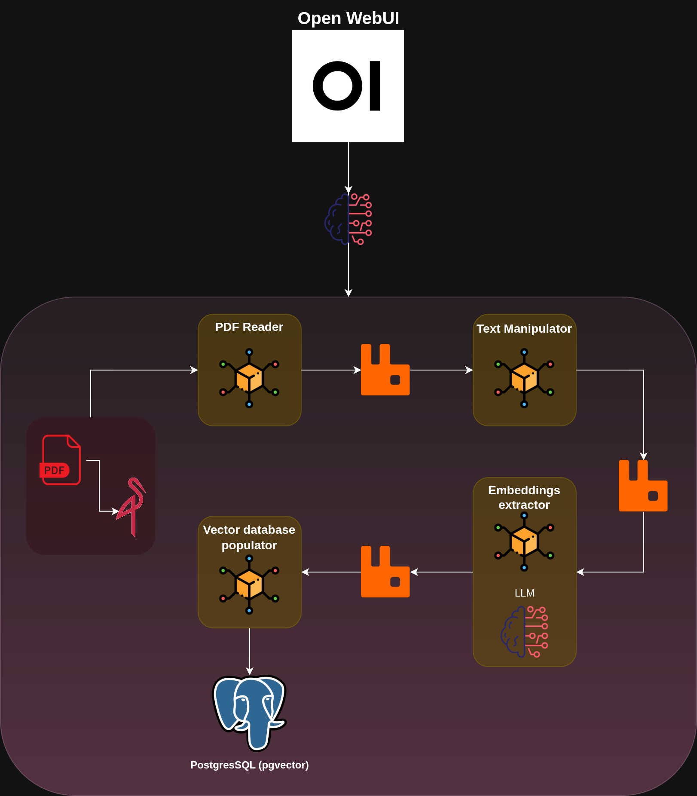

## RAGflow Architecture (PROJECT UNDER DEVELOPMENT)



# Docker Compose Infrastructure Stack

This Docker Compose configuration defines a three-service infrastructure stack commonly used for web applications. The stack provides object storage, message queuing, and relational database capabilities - a solid foundation for microservices or applications requiring file storage, async processing, and structured data management.

## Services Overview

### MinIO Service
**Purpose**: S3-compatible object storage server

- **Image**: `quay.io/minio/minio:RELEASE.2025-04-22T22-12-26Z`
- **Container Name**: `minio`
- **Ports**:
  - `9000:9000` - API access
  - `9001:9001` - Web console interface
- **Data Storage**: Persistent volume mounted at `/data`
- **Functionality**: Serves files and provides a management interface for object storage operations

### RabbitMQ Service
**Purpose**: Message broker for asynchronous communication

- **Image**: `rabbitmq:4.1.0-management-alpine`
- **Container Name**: `rabbitmq`
- **Ports**:
  - `5672:5672` - AMQP messaging traffic
  - `15672:15672` - Web-based management UI
- **Base OS**: Alpine Linux for reduced footprint
- **Data Storage**: Persists queue data and configuration in dedicated volume

### PostgreSQL Service
**Purpose**: Relational database server

- **Image**: `postgres:17.5-alpine`
- **Container Name**: `postgres`
- **Ports**:
  - `5432:5432` - Standard database connections
- **Base OS**: Alpine Linux variant for smaller image size
- **Data Storage**: Database files stored in persistent volume

## Infrastructure Configuration

### Common Patterns
All services in this stack share several configuration patterns:

- **Environment Variables**: Configuration loaded from `.env` file
- **Restart Policy**: `unless-stopped` - automatic restart unless manually stopped
- **Network**: Connected to shared bridge network named "app" for inter-service communication
- **Data Persistence**: Named volumes ensure data survives container restarts

### Volumes
- `minio_data`: Stores MinIO object data
- `rabbitmq_data`: Persists RabbitMQ queue data and configuration
- `postgres_data`: Contains PostgreSQL database files

### Network
- `app`: Bridge network enabling communication between all services

---

# Getting Started

First, create a copy of the `.env.example` file and name it `.env` so as for the `compose` stack to detect it. Update the values overriding the existing ones to configure a secure environment for your services.

```bash
cp .env.example .env
```
### Start the services:
```bash
docker compose up -d
```

### Verify services are running:
```bash
docker compose ps
```

### Stop the services (when needed):
```bash
docker compose down
```

## References

1. [The Ultimate Guide to using PGVector](https://medium.com/@intuitivedl/the-ultimate-guide-to-using-pgvector-76239864bbfb)